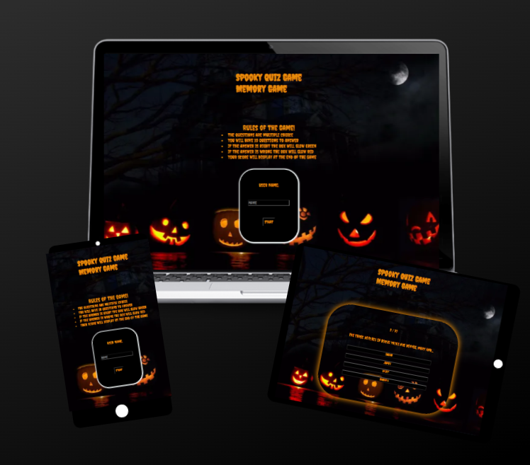

# Spooky Spooky Quiz Halloween Inspired Memory Game!

## About Spooky Quiz Game

The quiz game is a website for user to practice their knowledge on all things Haloween!
New and frequent users can expect randomised questions each visit up to the maximum questions inputed. 
Users will be able to select an answer, which if correct they'll move onto next question. 
The site displays a username login page with the rules displayed.

The website can be accessed via this [link]()

## User Stories / Goals

### First Time Visitor and Returning Visitor Goals:
* As a first time visitor i want to see a discriptive title and list of rules to determine what kind of game i will be playing.

* I want simple easy to use descriptive buttons to navigate through the game.

* I want to see how many questions are in the quiz and how many i have answered as I go through the quiz.

## Features

- Rules of the game
- Randomly generated questions 
- Multiple choice answers
- Score tracking (correct or incorrect)
- Username login
- Answer buttons color coded for right or wrong answers.

## Design

### Main Hero Image

### Colour scheme

 

## Deployment

The site was deployed to GitHub.

Follow the steps to deploy:

- In the Github repository, open the settings tab
- From the drop-dowm menu, selct **Main** branch and then **Save**

## Local Deployment

To make a local copy of this project, you can clone it. In your IDE, type the following command:
git clone

## Testing

### Light House

- Login Page [Desktop]() |
  [Mobile]()

### Chrome Responsive Viewer

- Login Page

- Game Page

### Manual Testing

| Feature | Action | Expected result | Tested | Passed | Comments |

### Compatability

[Google Chrome](https;//google.co.uk) Manually tested on google chrome for functionality , apperance and responsivness. All features passed.

[Internet Explorer](https://www.microsoft.com/en-gb/download/internet-explorer.aspx) Manually tested on google chrome for functionality , apperance and responsivness. All features passed.

### Validator

## Bugs

## Languages

[HTML](https://www.w3schools.com/html/) for the foundation of the site.

[CSS](https://developer.mozilla.org/en-US/docs/Web/CSS) used to add style and layout.

[JavaScript]()

[Flexbox](https://developer.mozilla.org/en-US/docs/Learn/CSS/CSS_layout/Flexbox) to arrange items and make them responsive.

[VScode](https://code.visualstudio.com/) used as my tool for writing and editing code.

[Github](https://github.com/) used to host the code of the website.

[Gitpod](https://www.gitpod.io/) an open source CDE

## Credits

[Code](https://www.w3schools.com) Used to understand flexbox and box models

[Flex box Kevin powell](https://www.youtube.com/watch?v=vQAvjof1oe4) Videos on flexbox

[Fontawesome](https://fontawesome.com/)

[Color Palette generator](https://convertingcolors.com/)

[Chrome Responsive Viewer](https://chrome.google.com/webstore/detail/responsive-viewer/inmopeiepgfljkpkidclfgbgbmfcennb)

[Light House](https://developer.chrome.com/docs/lighthouse/overview/)

[HTML | CSS Validator](https://validator.w3.org/nu/)

## Acknowledgments

[Code institute](https://learn.codeinstitute.net/) Mentor Juliia Konovalova
